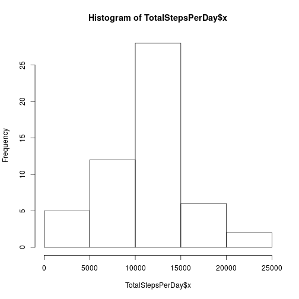
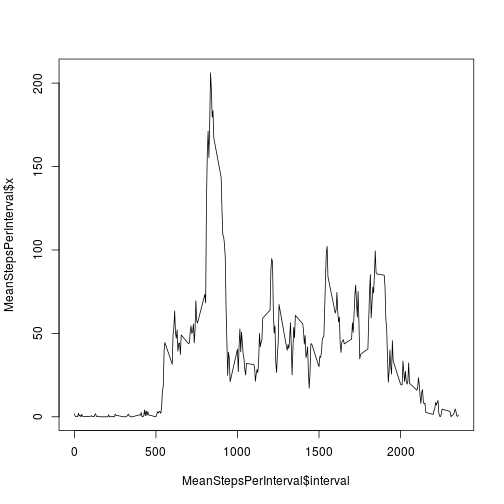
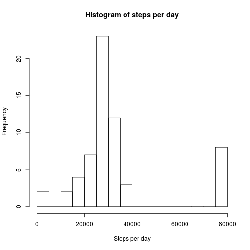
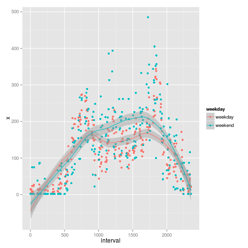

## Loading and preprocessing the data
Once data is loaded, the preprocessing consist in:

* Remove N/A data
* Arrange data to have just one row per day with the amount of steps taken that day.


```r
Dataraw<- read.csv("./activity.csv",sep=",",header=TRUE)
Data<-Dataraw[!is.na(Dataraw$steps),]
TotalStepsPerDay<-aggregate(Data$steps,by=list(Date=Data$date),sum)
```

## What is mean total number of steps taken per day?

The mean is: 1.0766189 &times; 10<sup>4</sup> steps taken per day

The median is: 10765 of steps 

And the histogram is:


```r
hist(TotalStepsPerDay$x)
```

 

## What is the average daily activity pattern?


```r
MeanStepsPerInterval<-aggregate(Data$steps,by=list(interval=Data$interval),mean)      
plot(MeanStepsPerInterval$interval,MeanStepsPerInterval$x,type="l")
```

 

The interval of the day that contains the maximum number of steps is:


```r
head(MeanStepsPerInterval[which.max(MeanStepsPerInterval$x),]) 
```

```
##     interval        x
## 104      835 206.1698
```

## Imputing missing values

The number of missing values is: 2304 out of 17568

Missing values have been obtained by:

 * Averaging known data for each interval of the day
 * Filling missing values with the averaged value of the day interval to which they belong.
 

```r
 f <- function (x) {
  if (is.na(x[1]))
    {x[1]<-floor(MeanStepsPerInterval[which(MeanStepsPerInterval$interval==as.integer(x[3])),2])
     }
  else 
    {x[1]<-x[1]}
  x
 }

r<-apply(Dataraw,1,f)
CompleteData<-as.data.frame(t(r))
CompleteData$steps<-as.integer(CompleteData$steps)
CompleteData$date<-as.Date(CompleteData$date)
```

The histogram with the data completed is:

```r
StepsPerDayComplete<-aggregate(CompleteData$steps,by=list(Date=CompleteData$date),sum)
hist(StepsPerDayComplete$x)
```

 

The mean is: 3.328677 &times; 10<sup>4</sup> steps taken per day

The median is: 28932 of steps 

### conclusion

The plots and results shown above show the importance of the missing data and how important is the strategy for filling the missing data. Since the study changes notably from one case to another.

## Are there differences in activity patterns between weekdays and weekends?


```r
weekdayFunction<-function (x){
  if (weekdays(as.Date(x[2]))=="sabado"  || weekdays(as.Date(x[2]))=="domingo")
  {"weekend"}else {"weekday"}
}

r<-apply(CompleteData,1,weekdayFunction)
weekdayColumn<-data.frame(weekday=r)

r<-cbind(CompleteData,weekdayColumn)
a<- aggregate(r$steps, by=list(interval=r$interval,weekday=r$weekday), mean)
a[,1]<-as.numeric(levels(a[,1]))

library(ggplot2)

q<-ggplot(data=a, aes(interval, x, color=weekday))+ geom_point() +stat_smooth()
q
```

 

### conclusion 

It is clearly observed that the steps taken in  weekends are higher and more disperse. This might be a consequence that the week routine changes on those days.
